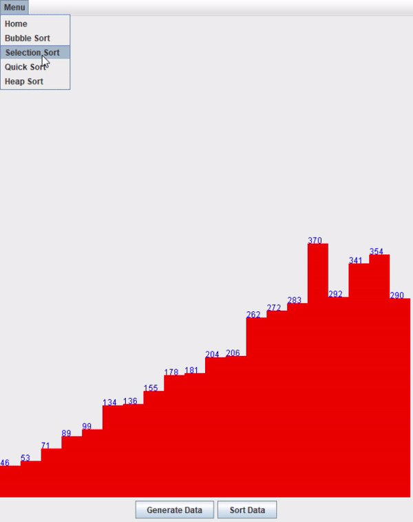

# Sorting-Algorithms-GUI

## description

This project is to show several different sorting algorithms using the java swing packages.
The purpose of this project is to show how efficient each sorting algorithm is visually for
any learners that are new to sorting algorithms and have a trouble visualizing it.

## types of algorithms

    - Bubble Sort
    - Heap Sort
    - Selection Sort
    - Quick Sort

## How to Run

1. **Ensure Java is Installed**: Make sure Java Development Kit (JDK) is installed on your system. You can download it from [here](https://www.oracle.com/java/technologies/javase-jdk11-downloads.html).

2. **Navigate to the Correct Directory**: Open a terminal and navigate to the project directory.

3. **Compile the Program**: `javac src/app.java`

4. **Run the Program**: `java src/app`

5. **Remove .classes files**: `rm src/*.class`
